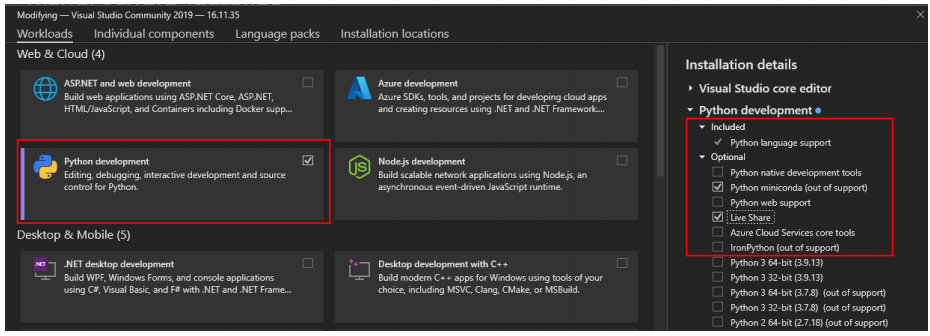
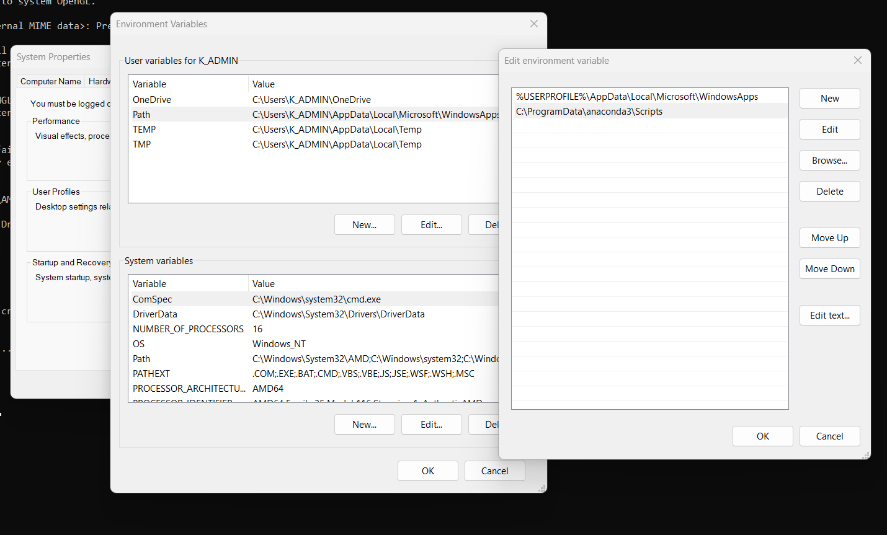

<H2>Setting Up The NPU Development Enviroment</H2>

<H3>NPU Available Devices</H3>


Ryzen AI engine enabled devices List can be Found at <a href="https://github.com/amd/RyzenAI-SW/issues/18">https://github.com/amd/RyzenAI-SW/issues/18</a>

<H3>Enable The NPU</H3>
After confirming your device is an Ryzen AI engine enabled device, make sure your NPU is enabled. In Windows 

<ul>
<li>Go to Device Manager --> System Devices </li>
<li>Look For AMD IPU Devices</li>
<li>If it does not appear in the list, you’ll need to 
enable the device in the BIOS.</li>
</ul>


<H3>Enable NPU in BIOS</H3>


Source:<a href="https://www.hackster.io/512342/amd-pervasive-ai- 
developer-contest-pc-ai-study-guide-6b49d8">https://www.hackster.io/512342/amd-pervasive-ai- 
developer-contest-pc-ai-study-guide-6b49d8</a>

<H3>Install Drivers and Dependencies</H3>

<H4>Install NPU Drivers</H4>

<ul>
<li>Download NPU Drivers from <a href="https://ryzenai.docs.amd.com/en/latest/inst.html">AMD Website</a></li>
<li>Extract the downloaded zip file.</li>
<li>Open a terminal in administrator mode and execute the <code>.\amd_install_kipudrv.bat</code> bat file.</li>
<li>Check the installation from Device Manager -> System Devices -> AMD IPU Device</li>
</ul>


<H4>Install Dependencies (RyzenAI SW 1.1)</H4>


When Installing VIsual Studio 2019, remember to install Python Development and Desktop Development with C++ enxtenions (From Tools --> Get Tools and Features).




Remember to set path variables for you softwares (Control Panel -> Advanced System Settings -> Environment Variable -> Edit -> add ).


Source:<a href="https://ryzenai.docs.amd.com/en/latest/inst.html">https://ryzenai.docs.amd.com/en/latest/inst.html</a>

<H3>Install Ryzen AI SW</H3>

Download the Ryzen AI software from <a href="https://ryzenai.docs.amd.com/en/latest/inst.html">AMD Website</a>. Extract the Zip and run `.\install.bat -env <env name>`. Change \<env name> to desired name. You can use `conda activate <env name>` to activate your environment


<b>Remember to use (activate) your Ryzen environment when running/developing the codes in this projects</b>

To test the installation, run the quicktest provided by AMD.

<ul>
<li>Activate the Ryzen environment

`conda activate <env name>`
</li>
<li>Go to 

`ryzen-ai-sw-1.1\quicktest` and run `quicktest.py` with 

```
cd ryzen-ai-sw-1.1\quicktest
python quicktest.py
```
</li>
<li>If everything is correctly installed, you will get

```
[Vitis AI EP] No. of Operators :   CPU     2    IPU   398  99.50%
[Vitis AI EP] No. of Subgraphs :   CPU     1    IPU     1 Actually running on IPU     1
...
Test Passed
...
```
</li>
<li>Check the installation from Device Manager -> System Devices -> AMD IPU Device</li>
</ul>


